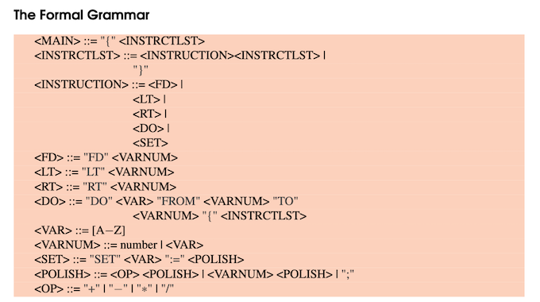
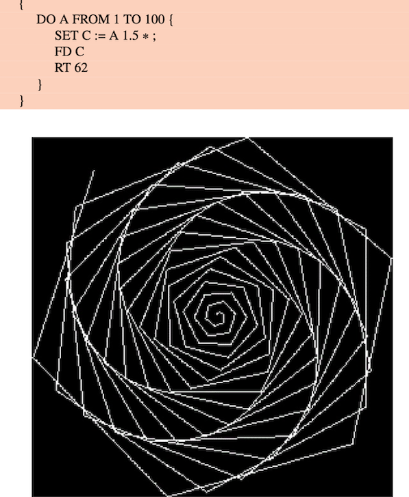

## Recursive-Descent-Parser

This is my recursive descent parser (RDP) for turtle graphics, the simple drawing language.

The parser forms the first part of the RDP. It receives instructions such as 'go forward, go left' etc,
and checks that the instructions comply with the turtle grammar. The grammar is provided below:

The parser then passes those instructions to the interpreter which draws on the screen using SDL. You'll find a basic and extended version of the RDP, as well as a makefile, and unit testing on both parser.c and interpreter.c. 

The drawings can be really cool. For instance:

And even cooler designs such as this one:

And this one:

And finally:

All code is ANSI C90 compliant, as per Neill Campbell's guidance.
