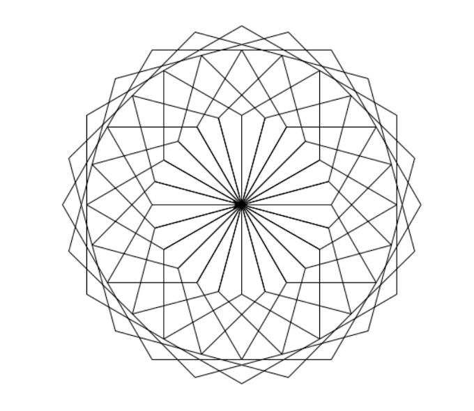
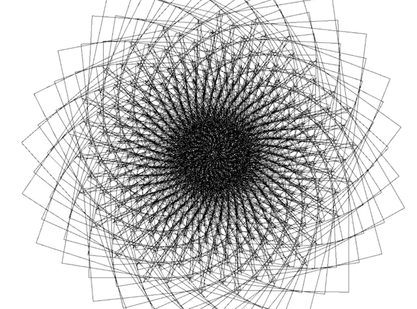
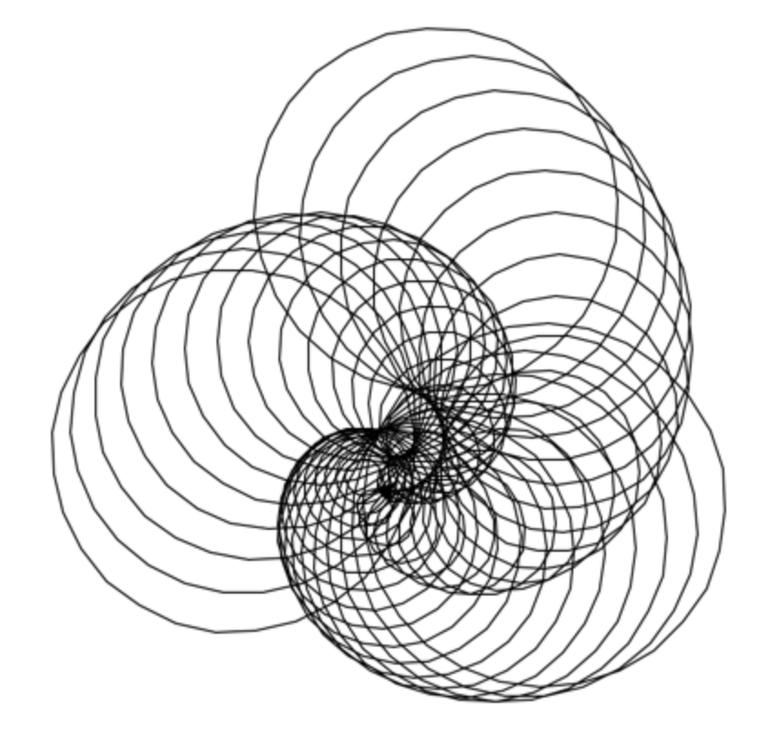

## Recursive-Descent-Parser

This is the basic version of the recursive descent parser for turtle graphics, the simple drawing language.

The parser forms the first part of the recursive descent parser for turtle graphics, the simple drawing language.

The parser receives instructions such as 'go forward, go left' etc, checks that the instructions comply with the
turtle grammar. It then passes those instructions to the interpreter which draws on the screen using SDL.

The drawings can be really cool. For instance:

And this one:

And finally:

